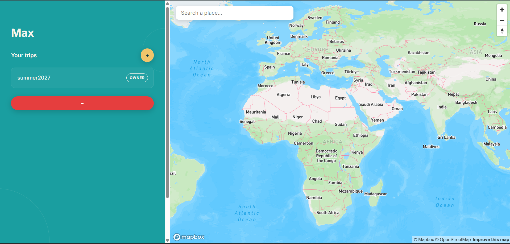
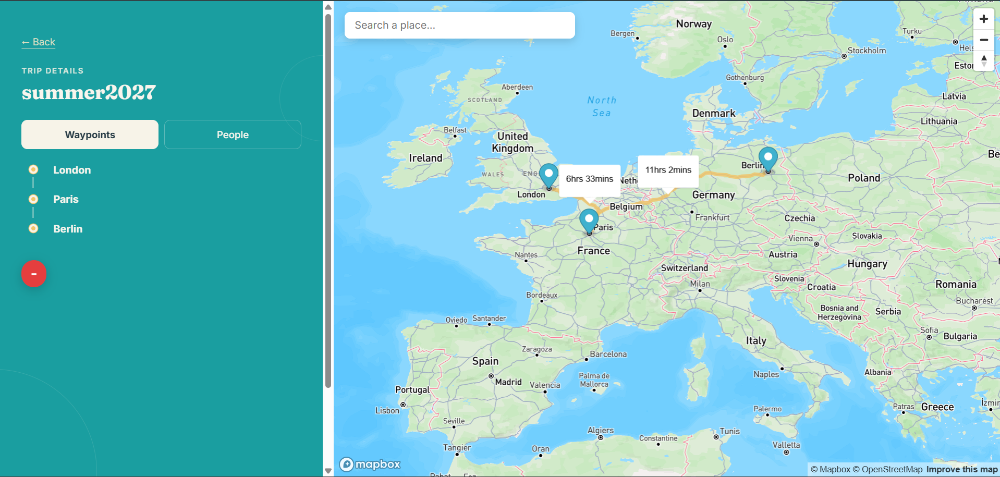
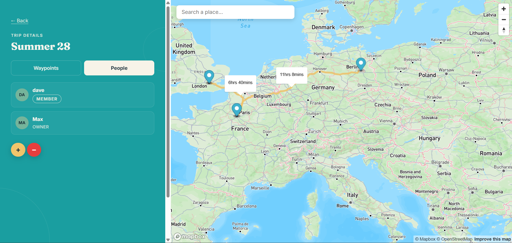
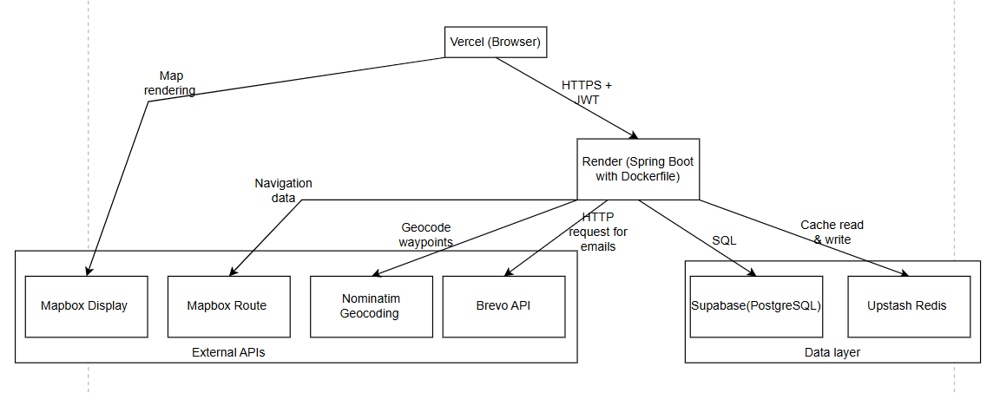
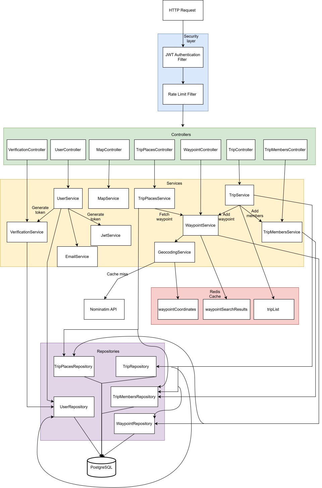

# TravelPlanner
A collaborative travel app with real-time route visualisation. 

## Images 
### Login page 

### Registration page 

### Home page 

### Trip details page 
 

 
## Features
- Trip creation 
- Member & Waypoint additions
- Member & Waypoint deletions 
- Member role editing 
- Real-time route visualisation with statistics

## Role hierarchy 
| Role   | Permissions                                                                                          |
|--------|------------------------------------------------------------------------------------------------------|
| OWNER  | - Add and delete members & waypoints  - Delete the trip   - Edit member and viewer roles   |
| MEMBER | - Add and delete members & waypoints                                                             |
| VIEWER | - View the trip                                                                                      | |

## Tech Stack
- Frontend: HTML, CSS, JS hosted via Vercel 
- Backend: Spring Boot, Spring Security, Java hosted via Render 
- Database: PostgreSQL hosted via Supabase 
- Authentication: JWT
- API: Mapbox gl js, Brevo 
- Cache: Redis hosted via Upstash 
- Rate Limiter: Bucket4j

## Architecture
### Deployment Architecture

### Backend Package Architecture

## API Endpoints
### Trips 
| Method | Endpoint                  | Description                   |
| ------ |---------------------------|-------------------------------|
| POST | /travelplanner/createTrip | Add new trip                  | 
| GET | /travelplanner/*/map-data | Return all details for a trip |
| GET | /travelplanner/retrieve-trips | Return user's list of trips   |   
| DELETE | /travelplanner/*/deleteTrip | Delete trip | 

### TripPlaces 
| Method | Endpoint                                  | Description |
| ------ |-------------------------------------------| ----------- |
| POST | /travelplanner/*/addWaypoint              | Add waypoint to trip |
| DELETE | /travelplanner/ * /deleteLinkedWaypoint/* | Delete waypoint from trip |

### TripMembers
| Method | Endpoint                                    | Description | 
| ------ |---------------------------------------------| ----------- | 
| POST | /travelplanner/ * /members/addMember/*      | Add member to trip | 
| DELETE | /travelplanner/ * /members/deleteMember/*   | Delete member from trip | 
| PUT | /travelplanner/ * /members/editMemberRole/* | Edit a member's role | 

### Map

| Method | Endpoint | Description                                      | 
| ------ | -------- |--------------------------------------------------| 
| GET | /travelplanner/map/getMapToken | Return Mapbox api key                            | 
| GET | /travelplanner/map/getRoute | Return directions and duration between waypoints |

### Users
| Method | Endpoint                | Description | 
| ------ |-------------------------| ----------- | 
| POST   | /travelplanner/login    | Check user credentials |
| POST   | /travelplanner/register | Create new user account | 
| GET | /travelplanner/users/*/search | Search for user accounts |

### Verification
| Method | Endpoint              | Description                                 | 
|--------|-----------------------|---------------------------------------------|
| GET | traveplanner/verify   | Check verification token and enable account |

### Waypoints 
| Method                             | Endpoint                       | Description |
|------------------------------------|--------------------------------| ----------- |
| GET | /travelplanner/waypoint/search | Search for waypoints | 

## Performance Features
### Caching
#### tripList cache
- Purpose: Stores the user's list of trips and their role in each trip 
- TTL: 168 hours, stale data & trips which don't get viewed get removed
- Benefit: Performance optimisation, less database queries every time list is viewed 

Cache additions & uses: 

| Endpoint        | Key                     | 
|-----------------|-------------------------|
| /retrieve-trips | Users who are logged in |

Cache deletions : 

| Endpoint                     | Key                           | 
|------------------------------|-------------------------------|
| /createTrip                  | The user who created new trip | 
| /*/deleteTrip                | All users apart of the deleted trip |
| /*/members/addMember/ *      | The user added to the trip | 
| /*/members/deleteMember/ *   | The user deleted from the trip |
| /*/members/editMemberRole/ * | The member whose role was edited | 

#### waypointCoordinates cache 
- Purpose: Stores waypoint's coordinates and name 
- TTL: Until memory is full then LRU to remove, waypoints never change 
- Benefit: Performance optimisation, less database queries for popular locations 

Cache additions & uses:

| Method                               | Key                      | 
|--------------------------------------|--------------------------|
| getCoordinates() in GeocodingService | The name of the waypoint |
| /*/addWaypoint                       | Name of waypoint to add to trip  | 

#### waypointSearchResults 
- Purpose: Stores coordinates and names for every waypoint searched (including incomplete names, for example 'Lon' for 'London' will be stored)
- TTL: Until memory is full then LRU to remove, waypoints never change 
- Benefit: Less API usage, Nominatim API will not be called for popular locations

Cache additions & Uses:

| Method                        | Key                                                   | 
|-------------------------------|-------------------------------------------------------|
| /travelplanner/waypoint/search | The string of characters user has entered (minimum 3) |

### Rate Limiting
#### authBuckets
- 5 tokens per minute 
- Based on IP address 
- Prevents bots spamming the authentication endpoints, saving CPU resources 
- Endpoints: /login, /register, /verify 

#### searchBuckets 
- 20 tokens per minute 
- Based on userId 
- Prevents excessive use of heavy read & writes on database 
- Endpoints: /users/*/search, /retrieve-trips, /waypoint/search, /createTrip

#### externalApiBuckets
- 15 tokens per minute 
- Based on UserId
- Prevents excessive use of external APIs which have a usage limit   
- Endpoints: /* /map-data, /*/addWaypoint, /map/getMapToken

#### routeBuckets 
- 60 tokens per minute 
- Based on userId 
- Prevents excessive use of Mapbox's Directions API which has a limit
- Not in externalApiBuckets because trips can contain many waypoints, every two waypoints will call this endpoint so a larger limit required 
- Endpoint: /map/getRoute 

#### generalBuckets 
- 100 tokens per minute 
- Based on userId 
- Single row operations on DB so not using up too much resources
- Endpoints: /* /members/addMember/ *, * /members/deleteMember/ *, members/editMemberRole/ *

## How to run
### Local 
- Clone repository 
- Fill in .env with your own details 
- Go to register.html and click on the icon of the browser of your choice

### Production 
- Go to https://travel-planner-dcpd.vercel.app

## How To Contribute 
- Fork project 
- Create new branch with your GitHub name 
- Fill in .env file with your own details 
- Create pull request & wait for approval 

## Future Improvements & Known Limitations 
- Due to Render's free tier, the backend server spins down after 15 minutes of inactivity, either find a suitable replacement or set up a scheduled CRON job to prevent inactivity
- More unit tests for uncovered code 
- Add more interactive feature to map 